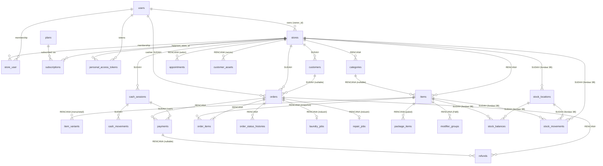

# Universal POS SaaS — Architecture

> Status: **audit & fondasi (Phase 0)**. Dokumen ini adalah acuan implementasi.
> Setiap bagian ditandai **Sudah diimplementasikan** atau **Rencana** agar
> tidak ada asumsi yang disalahartikan sebagai kode yang sudah ada.

Versi terakhir audit: 2026-10-10 (Phase 3B Checkpoint 1 — fondasi inventory).

---

## 1. Ringkasan Sistem

Aplikasi adalah **multi-tenant SaaS POS** berbasis Laravel 13 / PHP 8.3 /
MySQL 8 dengan klien Flutter. Satu platform melayani banyak jenis bisnis
melalui fondasi **Universal POS** yang sama, lalu ditambah modul khusus
industri secara bertahap.

Prinsip utama:

1. **Satu fondasi universal** — kategori, katalog item, pelanggan, order,
   pembayaran, sesi kasir, laporan penjualan dipakai semua jenis bisnis.
2. **Modul industri sebagai ekstensi** — retail, F&B, laundry, servis, salon
   menambah tabel/workflow sendiri, tidak mencampur semuanya ke satu tabel.
3. **Tenant isolation by token** — toko aktif ditentukan server, bukan client.
4. **Uang dalam satuan terkecil** (integer), tanpa `float`/`double`.
5. **Snapshot pada transaksi** — order menyimpan salinan data item/harga.

### Stack & konvensi aktual

| Aspek | Nilai | Status |
|-------|-------|--------|
| Framework | Laravel 13.17 | Sudah |
| PHP | 8.3 | Sudah |
| Auth API | Laravel Sanctum (Bearer token) | Sudah |
| Prefix API | `/api` (tanpa `/api/v1`) | Sudah |
| Database produksi | MySQL 8 | Sudah |
| Database test | SQLite `:memory:` (`phpunit.xml`) | Sudah |
| Formatter | Laravel Pint (`vendor/bin/pint`) | Sudah |
| Model attributes | `#[Fillable]`, `#[Hidden]` (User), `$fillable` (lainnya) | Sudah |

---

## 2. Keputusan Arsitektur (ADR ringkas)

| # | Keputusan | Alasan utama | Status |
|---|-----------|--------------|--------|
| D1 | Current store disimpan **per token** Sanctum | Multi-device punya konteks toko independen | Sudah |
| D2 | Otorisasi tenant dari token, bukan `store_id` request | Mencegah IDOR/enumeration tenant | Sudah |
| D3 | Katalog universal memakai **satu tabel `items`** + `type` | Cart/order seragam, satu API, mudah diskalakan | Rencana |
| D4 | Tidak ada tabel `products` paralel dengan `items` | Menghindari tanggung jawab tumpang tindih | Rencana |
| D5 | Semua uang disimpan sebagai **integer minor units** | Menghindari galat pembulatan float | Sudah (plans) / Rencana (order) |
| D6 | Order menyimpan **snapshot** item & harga | Riwayat transaksi stabil walau katalog berubah | Rencana |
| D7 | Status fulfillment dan status pembayaran **dipisah** | `paid` saja tidak cukup untuk unpaid/partial/refund | Rencana |
| D8 | Pembayaran mendukung **banyak baris per order** | Tunai + non-tunai, split payment, partial | Rencana |
| D9 | Industri memakai tabel ekstensi, bukan kolom boolean | Menghindari puluhan `is_*` di `stores` | Rencana |
| D10 | `business_type` disimpan sebagai kolom enum string di `stores` | Gating modul, mudah divalidasi, backward-compatible | **Sudah** |
| D11 | Tidak memakai global scope tenant saat ini | Global scope rentan lupa di-`withoutGlobalScope` | Sudah (kebijakan) |
| D12 | Tidak menambah paket permission dulu | Role string belum butuh Spatie; Policies cukup | Sudah (kebijakan) |
| D13 | Kuota `max_products` menghitung **semua item katalog** | Definisi tunggal, konsisten, sulit diakali | Rencana |
| D14 | Nomor order unik **per toko** (composite unique) | Nomor boleh sama antar tenant | Rencana |

---

## 3. ERD Konseptual

Entitas bergaris penuh dan berlabel **Sudah** sudah ada. Entitas berlabel
**Rencana** belum dibuat. Nama tabel mengikuti konvensi plural.

Catatan: `order_items` mereferensikan `items` **secara opsional** (`item_id`
nullable) karena item bisa dihapus/diubah; data penting disalin sebagai
snapshot.

---

## 4. Entitas Inti — Field & Tanggung Jawab

### 4.1 Sudah diimplementasikan

#### `users`
- `id`, `name`, `email` (unique), `password`, `email_verified_at`, timestamps.
- Tanggung jawab: identitas login lintas store.

#### `stores`
- `id`, `owner_id` (FK users), `name`, `slug` (unique), `phone`, `email`,
  `address`, `city`, `province`, `postal_code`, `logo`, `is_active`,
  **`business_type`** (string(30), default `other`, indexed), timestamps.
- Tanggung jawab: entitas tenant utama.

#### `store_user` (pivot membership)
- `id`, `store_id`, `user_id`, `role` (string), `is_active`, timestamps.
- Unique `(store_id, user_id)`, index `(store_id, is_active)` dan
  `(user_id, is_active)`.
- Tanggung jawab: keanggotaan + role per store.

#### `plans`
- `id`, `name`, `slug`, `description`, `price_monthly`, `price_yearly`,
  `max_stores`, `max_users_per_store`, `max_products`,
  `max_transactions_per_month`, `is_active`, `sort_order`, timestamps.
- Harga = integer minor units. `max_*` nullable = tidak terbatas.
- Tanggung jawab: definisi paket + batas kuota.

#### `subscriptions`
- `id`, `store_id`, `plan_id`, `status`, `billing_cycle`, `starts_at`,
  `ends_at`, `trial_ends_at`, `cancelled_at`, timestamps.
- **Satu subscription per store** (bukan per akun/user).
- Tanggung jawab: langganan plan yang aktif untuk sebuah store.

#### `personal_access_tokens` (Sanctum + ekstensi)
- Kolom bawaan + `current_store_id` (FK stores, nullable, nullOnDelete).
- Tanggung jawab: token API + konteks toko aktif per token.

#### `business_type` (enum PHP `App\Enums\BusinessType`)
- Nilai: `retail`, `restaurant`, `laundry`, `repair`, `salon`, `other`.
- Kolom `stores.business_type` sudah ada; register menerima nilai opsional.

### 4.2 Universal POS — status per Phase 2

#### `categories` (Sudah — Phase 1a)
- `id`, `store_id`, `parent_id` (nullable, self FK), `name`,
  `type` (nullable, item type jika kategori dikhususkan), `sort_order`,
  `is_active`, timestamps.
- Unique `(store_id, parent_id, name)` (rekomendasi) atau `(store_id, name)`.
- Tanggung jawab: pengelompokan item. **Wajib** `store_id` = toko aktif.
- Menghapus kategori: pilih `nullOnDelete` pada `items.category_id`.

#### `items` — katalog universal (Sudah — Phase 1b)
| Field | Tipe | Catatan |
|-------|------|---------|
| `id` | bigint | |
| `store_id` | FK stores | cascadeOnDelete |
| `category_id` | FK categories nullable | nullOnDelete; **validasi satu toko** |
| `name` | string(150) | |
| `type` | string(20) | enum `ItemType`: product/service/menu/package |
| `sku` | string(64) nullable | unik per toko bila diisi |
| `barcode` | string(64) nullable | unik per toko bila diisi |
| `description` | text nullable | |
| `cost_price` | bigint nullable | minor units; `null` = tidak dilacak |
| `selling_price` | bigint default 0 | minor units |
| `unit` | string(20) default `pcs` | `pcs`, `kg`, `liter`, `jam`, dll |
| `tracks_stock` | boolean default false | **Sudah (Phase 3B foundation)**; true hanya untuk yang pakai stok |
| `is_active` | boolean default true | untuk menyembunyikan dari POS |
| `created_at`/`updated_at` | timestamps | |

Index/unique yang direkomendasikan:
- `unique(store_id, sku)`
- `unique(store_id, barcode)`
- `index(store_id, is_active)`
- `index(store_id, type)`
- `index(store_id, category_id)`
- `index(store_id, tracks_stock)` **Sudah (Phase 3B foundation)**

> Catatan: `tracks_stock` sempat direncanakan di §4.2 tetapi baru benar-benar
> dibuat pada Phase 3B Checkpoint 1. Item lama tetap `false`.

#### Foundation inventory (Sudah — Phase 3B Checkpoint 1)

Hanya fondasi database/model; belum ada endpoint, service ledger, reservasi,
komit, adjustment, atau transfer. Lihat `docs/inventory-design.md`.

- `stock_locations` — `id`, `store_id` (cascade), `name` (unique per store),
  `code` nullable (unique per store), `type` (enum `StockLocationType`:
  `warehouse`/`outlet`/`other`), `is_default`, `is_active`, `default_guard`
  (string nullable **unique**, jaminan portabel satu default per store),
  timestamps.
- `stock_balances` — `id`, `store_id`, `stock_location_id`, `item_id`,
  `quantity_on_hand` decimal(12,3) default 0, `quantity_reserved` decimal(12,3)
  default 0, timestamps; unique `(stock_location_id, item_id)`.
  `available = on_hand - reserved`. Tanpa DB CHECK (alasan portabilitas di
  `docs/inventory-design.md` §9).
- `stock_movements` — ledger append-only: `store_id`, `stock_location_id`,
  `item_id`, `type` (enum `StockMovementType`), `quantity` decimal(12,3)
  (selalu positif), `unit_cost` nullable, `order_id`/`order_item_id` nullable,
  `reversal_of_id` nullable (self), `idempotency_key` nullable
  (unique per store), `note`, `created_by`, `occurred_at`, timestamps.

#### `customers` (Sudah — Phase 2, soft delete)
- `id`, `store_id`, `name`, `phone` nullable, `email` nullable, `address`
  nullable, `note` nullable, `is_active`, timestamps.
- Unique opsional `(store_id, phone)`. Tanpa login/loyalty dulu.

#### `orders` (Sudah — Phase 2)
| Field | Tipe | Catatan |
|-------|------|---------|
| `id` | bigint | |
| `store_id` | FK stores | |
| `number` | string(40) | unik per toko |
| `customer_id` | FK customers nullable | walk-in boleh null |
| `status` | string(20) | `draft`/`open`/`completed`/`cancelled` |
| `payment_status` | string(20) | `unpaid`/`partial`/`paid`/`refunded`/`partially_refunded` |
| `subtotal` | bigint | minor units |
| `discount_total` | bigint | |
| `tax_total` | bigint | |
| `service_charge_total` | bigint | untuk F&B (opsional) |
| `grand_total` | bigint | |
| `paid_total` | bigint | akumulasi pembayaran |
| `change_due` | bigint | kembalian tunai (≥0) |
| `currency` | string(3) default `IDR` | |
| `cashier_id` | FK users nullable | |
| `cash_session_id` | FK cash_sessions nullable | |
| `note` | text nullable | |
| `placed_at` | timestamp | waktu transaksi |
| `cancelled_at` | timestamp nullable | |
| `cancel_reason` | string nullable | |
| timestamps | | |

Unique `(store_id, number)`; index `(store_id, placed_at)`,
`(store_id, status)`, `(store_id, payment_status)`.

#### `order_items` (Sudah — Phase 2)
| Field | Tipe | Catatan |
|-------|------|---------|
| `id` | bigint | |
| `order_id` | FK orders | cascadeOnDelete |
| `item_id` | FK items nullable | referensi katalog bila ada |
| `parent_order_item_id` | FK order_items nullable | untuk modifier/kombo |
| `name` | string | **snapshot** |
| `type` | string(20) | **snapshot** item type |
| `unit_price` | bigint | harga saat transaksi |
| `quantity` | decimal(12,3) | mendukung berat (laundry kg) |
| `discount` | bigint | diskon baris |
| `tax` | bigint | pajak baris |
| `line_subtotal` | bigint | `unit_price * quantity` |
| `line_total` | bigint | setelah diskon + pajak |
| `note` | string nullable | |
| timestamps | | |

#### `payments` (Sudah — Phase 2)
| Field | Tipe | Catatan |
|-------|------|---------|
| `id` | bigint | |
| `order_id` | FK orders | |
| `method` | string(20) | cash/card/transfer/qris/ewallet/other |
| `amount` | bigint | minor units |
| `status` | string(20) | pending/completed/failed/voided |
| `reference` | string nullable | no. referensi EDC/QRIS/transfer |
| `received_by` | FK users nullable | |
| `paid_at` | timestamp nullable | |
| `cash_session_id` | FK cash_sessions nullable | rekonsiliasi kas |
| timestamps | | |

#### `refunds` (Rencana — belum ada alur refund)
- `id`, `order_id`, `payment_id` nullable, `amount`, `reason`,
  `refunded_by` (FK users nullable), `refunded_at`, timestamps.
- Alternatif "payment negatif" ditolak agar audit lebih jelas.

#### `order_status_histories` (Sudah — Phase 2, audit terbatas)
- `id`, `order_id`, `from_status`, `to_status`, `from_payment_status`,
  `to_payment_status`, `changed_by` (FK users nullable), `reason` nullable,
  `created_at`.

#### `store_sequences` (Sudah — Phase 2)
- `id`, `store_id`, `sequence_key` (mis. `orders:2026-10-09`), `last_value`,
  timestamps; unique `(store_id, sequence_key)`.
- Counter persisten per toko untuk nomor dokumen yang aman dari race. Nomor
  order tidak pernah diturunkan dari jumlah baris.

#### `cash_sessions` (Sudah — Phase 3A)
- `id`, `store_id`, `cashier_id`, `status` (`open`/`closed`), `opening_cash`,
  `opened_at`, `closed_at`, `expected_cash`, `actual_cash`, `difference`
  (signed), `opening_notes`, `closing_notes`, `open_guard`, timestamps.
- `open_guard` = `"<store_id>:<cashier_id>"` saat terbuka, `NULL` saat tutup;
  unique index = jaminan satu shift terbuka per kasir/toko (race-safe).
- `expected_cash = opening_cash + cash_in - cash_out + cash_sales`.

#### `cash_movements` (Sudah — Phase 3A)
- `id`, `store_id`, `cash_session_id`, `user_id`, `type` (`cash_in`/`cash_out`),
  `amount`, `reason`, timestamps.
- Append-only (tanpa endpoint edit/delete). Movement hanya pada shift terbuka.

#### `payments.cash_session_id` (Sudah — Phase 3A)
- Nullable FK; diisi hanya untuk pembayaran tunai yang tercatat pada shift
  terbuka milik pencatat. Pembayaran lama tetap `NULL` (tidak diatribusikan).

### 4.3 Rencana — Ekstensi industri (dibuat saat modulnya digarap)

| Industri | Tabel | Menempel pada |
|----------|-------|---------------|
| Retail | `suppliers`, `purchases`, `purchase_items`, `stock_opnames`, `returns` (fondasi `stock_locations`/`stock_balances`/`stock_movements` sudah ada — Phase 3B Checkpoint 1) | `items` |
| F&B | `modifier_groups`, `modifier_options`, `item_modifier_group`, `dining_tables`, `kitchen_tickets`, (`recipes`/`ingredients`) | `items`, `orders` |
| Laundry | `laundry_jobs` (berat, satuan, status pengerjaan, estimasi, pengambilan) | `orders`/`order_items` |
| Servis/Reparasi | `customer_assets`, `repair_jobs`, `repair_job_parts` | `orders`, `customers` |
| Salon | `appointments`, `staff_services`, `commissions` | `items`, `users`/membership |

Semua ekstensi tetap memiliki `store_id` (langsung atau via relasi induk)
dan tidak boleh di-query lintas tenant.

---

## 5. Katalog Universal — Rekomendasi Final

### 5.1 Satu tabel `items`, bukan `items` + `products`

**Rekomendasi: SATU tabel `items` dengan kolom `type`.**

Alasan:
- Cart/order di POS universal harus bisa berisi campuran (produk, jasa, menu,
  paket) dalam satu transaksi. Satu tabel membuat `order_items` hanya punya
  satu FK (`item_id`), bukan polymorphic multi-tabel.
- Satu API katalog (`/api/items`), satu validasi kuota, satu laporan.
- `type` sebagai diskriminator cukup untuk membedakan perilaku.

Trade-off:
- Ada kolom yang tidak relevan untuk sebagian tipe (mis. `tracks_stock` untuk
  jasa). Ini **dibatasi** ke field yang benar-benar universal.
- Field sangat spesifik (durasi layanan, berat per satuan) **tidak** ditaruh
  di `items`, melainkan di tabel ekstensi (`service_details`, `laundry_jobs`).

**Ditolak:** tabel `products` terpisah yang menduplikasi `items`, karena
tanggung jawab tumpang tindih dan memaksa `order_items` polymorphic.

### 5.2 Field untuk seluruh jenis bisnis

Semua field di §4.2 dapat dipetakan ke empat tipe:

| Field | product | service | menu | package |
|-------|:---:|:---:|:---:|:---:|
| `sku`/`barcode` | ya (opsional) | jarang | jarang | opsional |
| `cost_price` | ya | sering `null` | ya | turunan |
| `selling_price` | ya | ya | ya | ya |
| `unit` | pcs/kg | jam/sesi | porsi | paket |
| `tracks_stock` | true | false | false/true | false |

### 5.3 `cost_price`: nullable

**Rekomendasi: `nullable`, `null` = harga pokok tidak dilacak.**

- Jasa/laundry sering tidak punya COGS per item; `0` akan salah mengartikan
  "gratis". Laporan margin wajib memperlakukan `null` sebagai "tidak diketahui".
- Jangan memberi default `0` yang menyamakan "belum diisi" dengan "nol".

### 5.4 SKU & barcode: opsional di level DB

**Rekomendasi: selalu `nullable` di database; kewajiban bersifat aturan
aplikasi per tipe, bukan constraint DB.**

- Retail biasanya wajib SKU; salon/laundry tidak. Aturan "wajib SKU untuk
  `type=product`" ditegakkan di FormRequest/Service, dapat dikonfigurasi.
- **Unik per toko**: `unique(store_id, sku)` dan `unique(store_id, barcode)`.
  MySQL memperlakukan `NULL` sebagai nilai berbeda, sehingga banyak item boleh
  tanpa SKU/barcode, tetapi nilai yang diisi tetap unik per store.

**Peringatan soft delete:** jika `items` memakai `SoftDeletes`, unique
`(store_id, sku)` akan **memblokir pemakaian ulang SKU** item yang dihapus.
Rekomendasi Phase 0: **hard delete** pada katalog dan andalkan snapshot di
`order_items`. Jika nanti butuh soft delete, siapkan strategi khusus
(mis. memindahkan SKU ke sampah/`deleted_sku`), jangan asal menambah
`deleted_at` ke dalam unique index (karena `NULL` merusak keunikan).

### 5.5 Mencegah kategori lintas toko

Dua lapis:
1. **Wajib (aplikasi):** saat menyimpan item, ambil kategori melalui
   `$store->categories()->findOrFail($categoryId)` sehingga kategori toko lain
   → 404/422.
2. **Opsional (database, hardening):** composite FK
   `items(store_id, category_id)` → `categories(store_id, id)` dengan
   `unique(store_id, id)` pada `categories`. Ini menjamin di level DB, dengan
   trade-off skema sedikit lebih rumit. Direkomendasikan untuk Phase 1 jika
   biaya migrasi dapat diterima.

### 5.6 Tabel tambahan: varian, modifier, komponen paket

**Perlu, tetapi sebagai tabel ekstensi terpisah, dibangun saat modulnya masuk:**

- `item_variants` (retail/menu: ukuran, warna) — 1 item : banyak varian.
- `modifier_groups` + `modifier_options` + pivot ke item (F&B).
- `package_items` (package → `item_id` + `quantity`) untuk paket/bundle.
- `service_details` (durasi, komisi) bila salon/servis butuh.

`items.type = 'package'` hanya menandai bahwa item adalah paket; isi paket
tetap di `package_items`. Ini mencegah `items` membengkak dengan kolom langka.

### 5.7 Kuota `max_products` vs katalog universal

**Rekomendasi: `max_products` menghitung SELURUH baris `items` pada store
(semua tipe, aktif maupun nonaktif, mengecualikan soft-deleted bila kelak
dipakai).**

Alasan: definisi tunggal, mudah dihitung, dan mencegah pengguna "mengakali"
kuota dengan menonaktifkan item lama untuk menambah item baru.

Konsekuensi & catatan:
- `max_products` bukan hanya "produk"; secara konsep ia adalah
  **kuota item katalog**. Nama kolom dipertahankan demi kompatibilitas, makna
  didokumentasikan di sini.
- Varian/modifier **belum** dihitung. Trade-off: satu item dengan banyak varian
  bisa melewati kuota. Mitigasi masa depan: hitung varian juga, atau batasi
  jumlah varian per item.
- Perubahan nama kolom (mis. `max_catalog_items`) **tidak** dilakukan sekarang;
  perlu persetujuan (lihat §11).

---

## 6. Transaksi & Pembayaran — Strategi

### 6.1 Dua status terpisah (bukan `paid` saja)

Implementasi aktual (Phase 2):

- `orders.fulfillment_status` (operasional): `pending` → `processing` →
  `completed` / `cancelled`. `completed` dan `cancelled` final.
- `orders.payment_status` (keuangan): `unpaid` → `partially_paid` → `paid`.
  `refunded` disediakan tetapi belum reachable (belum ada alur refund).

Ini mendukung:
- **Belum dibayar:** `fulfillment_status=pending`, `payment_status=unpaid`.
- **Bayar sebagian:** `payment_status=partially_paid`, `paid_amount < total_amount`.
- **Lunas:** `payment_status=paid`.
- Kembalian tunai/`change_due` **belum** dimodelkan (masih manual).

### 6.2 Pembayaran tunai & non-tunai

- Tunai: `payments.method = cash`, boleh melebihi total; selisih → kembalian.
- Non-tunai: `card`, `bank_transfer`, `qris`, `ewallet`, `other`, dengan
  `reference` opsional. Status `pending` → `completed` saat settlement.

### 6.3 Pembayaran sebagian & beberapa metode

- `payments` 1 : N terhadap `orders`. Menambah baris pembayaran sampai
  `paid_total >= grand_total`.
- Satu order bisa punya banyak metode (mis. Rp 50k tunai + Rp 100k QRIS).

### 6.4 Pembatalan & refund

Implementasi aktual (Phase 2):
- **Cancel order:** ditolak (409 `order_conflict`) bila masih ada pembayaran
  aktif; void pembayaran dulu. Hanya owner/admin.
- **Void payment:** record tidak dihapus, hanya ditandai `voided` + aktor/waktu
  alasan; `payment_status` order dihitung ulang.
- **Refund:** tabel `refunds` belum dibuat; status `refunded` belum reachable.
- Perubahan status tercatat di `order_status_histories`.

### 6.5 Presisi uang & kuantitas

- **Uang:** `bigint` integer minor units (rupiah = tanpa desimal). **Tidak ada**
  `float`/`double`. Konsisten dengan `plans.price_monthly`.
- **Kuantitas:** `decimal(12,3)` agar berat (kg) dan jam dapat pecahan.
- **Pajak/diskon:** disimpan sebagai nominal final per baris + total, bukan
  dihitung ulang saat read, agar riwayat tidak berubah bila tarif berubah.

### 6.6 Nomor order unik per toko

Implementasi aktual (Phase 2):
- Unique `(store_id, order_number)`.
- Format: `TRX-{YYYYMMDD}-{0001}` (mis. `TRX-20261009-0007`).
- Sumber nomor: tabel `store_sequences` (counter persisten), di-`increment`
  di dalam transaksi yang memegang `lockForUpdate()` pada baris `stores`.
- **Belum ada test konkurensi MySQL nyata** (SQLite tidak mendukung row lock);
  lihat §11 dan `docs/order-api.md` §4.

### 6.7 Database transaction

Semua operasi multi-tabel (order + order_items + payments + update stok)
dibungkus `DB::transaction`. Checkout/payment gateway **tidak** dibuat pada
fase ini.

---

## 7. Batas Modul

### 7.1 Core SaaS (fondasi platform)

User & autentikasi; Store & membership; Role & authorization; Subscription &
plan; Tenant isolation. **Menggunakan tabel inti yang sudah ada.**

### 7.2 Universal POS (dipakai semua business type)

Categories; Catalog items; Customers; Orders & order items; Payments; Cash
sessions; Sales reports. **Wajib memakai fondasi ini** — jangan membuat
tabel transaksi/katalog sendiri per industri.

### 7.3 Modul industri (tabel/workflow sendiri)

| Modul | Isi | Wajib di atas Universal POS? |
|-------|-----|------------------------------|
| Retail | Inventory, stock movements, suppliers, purchasing, stock opname, returns | Ya; menambah tabel stok, bukan mengganti `items`/`orders` |
| Kafe & Restoran | Menu variants, modifiers, tables, kitchen tickets, recipes/ingredients | Ya; order tetap `orders` |
| Laundry | Service orders, berat & satuan, status pengerjaan, estimasi, pengambilan | Ya; memakai `orders`/`order_items` + `laundry_jobs` |
| Servis/Reparasi | Customer assets, keluhan/pemeriksaan, service jobs, spare parts, status | Ya; `customers` + `orders` + tabel job |
| Salon/Barbershop | Services, staff, appointments, durasi, komisi | Ya; layanan = `items(type=service)`, jadwal = `appointments` |

**Aturan batas:** industri hanya boleh **menambah** tabel yang mereferensikan
entitas universal (`items`, `orders`, `customers`). Dilarang membuat tabel
besar yang menggabungkan seluruh kebutuhan industri.

---

## 8. Business Type & Konfigurasi Store

### 8.1 Penyimpanan sebagai kolom `stores.business_type`

**Rekomendasi: kolom `string(30)` dengan nilai tervalidasi oleh enum PHP
`App\Enums\BusinessType`.** (Sudah diimplementasikan.)

Alasan:
- Satu store = satu jenis bisnis utama pada fase awal.
- Enum PHP memberi type-safety di kode + validasi `Rule::enum` di API.
- String kolom (bukan DB `ENUM`) memudahkan penambahan tipe baru tanpa
  migrasi `ALTER ENUM` yang kaku.
- Backward-compatible: `default('other')` sehingga toko lama dan request
  register tanpa `business_type` tetap valid.

### 8.2 Validasi & default toko lama

- Migrasi: `business_type` default `other`, ditambahkan index.
- Validasi register: `nullable|Rule::enum(BusinessType::class)`.
- Toko existing otomatis `other`; pemilik dapat memperbarui nanti.

### 8.3 Fitur opsional & konfigurasi operasional

- **Jangan** membuat puluhan boolean (`is_cafe`, `is_laundry`, ...) di `stores`.
- Gunakan `business_type` sebagai gerbang utama, lalu **tabel `store_settings`
  atau kolom JSON `settings`** untuk konfigurasi operasional (pajak default,
  service charge, pembulatan, template struk). **Rencana**, belum
  diimplementasikan — lihat keputusan yang butuh persetujuan.
- Perilaku modul (mis. apakah inventory aktif) diturunkan dari `business_type`
  + settings, bukan dari banyak flag.

### 8.4 Multi-jenis per toko

- Fase awal: **satu** `business_type` per store. Multi-jenis (mis. toko +
  kafe dalam satu store) direncanakan sebagai pivot `store_business_types`
  pada fase lanjutan, **tidak** diimplementasikan sekarang.

### 8.5 Dampak API

- `POST /api/auth/register` menerima `business_type` **opsional** (tidak
  breaking). Response store menambah field `business_type` (aditif).
- `GET /api/current-store`, `PUT /api/current-store`, `GET /api/me` menambah
  field `business_type` pada objek store (aditif, non-breaking).

---

## 9. Tenant Isolation & Authorization

Implementasi existing dipertahankan penuh (lihat juga `docs/tenant-isolation.md`).

### 9.1 Empat konsep yang dibedakan

| Konsep | Mekanisme | Pertanyaan |
|--------|-----------|-----------|
| Authentication | Sanctum | Siapa user-nya? |
| Membership | `store_user.is_active` | User ini anggota store mana? |
| Role authorization | Gate/Policy (rencana) | Boleh melakukan aksi apa? |
| Tenant isolation | `current.store` + scoped query | Data store mana yang boleh dilihat? |

### 9.2 Aturan wajib

- `store_id` dari request **tidak pernah** menjadi bukti otorisasi.
- Toko aktif diambil dari `EnsureCurrentStore` →
  `$request->attributes->get('current_store')`.
- Semua query data bisnis dibatasi `store_id` toko aktif.
- Relasi antar-data diverifikasi satu toko (kategori item, item order, dll).
- Record milik toko lain → 404 lewat `$store->relation()->findOrFail()`.
- Unik per tenant memakai composite unique `(store_id, ...)`.

### 9.3 Role & Policy

- Role saat ini **string** pada pivot (`owner`/`admin`/`cashier`); belum ada
  permission granular. Role string **bukan** sistem permission lengkap.
- **Rencana Phase 2+:** perkenalkan Laravel Policies (mis. `ItemPolicy`,
  `OrderPolicy`, `StorePolicy`) yang membaca `current_store_role` dan
  `business_type`. Gate sederhana (`Gate::define`) cukup untuk fase awal.
- **Tidak** menambah Spatie Permission tanpa kebutuhan teknis yang terbukti.

Matriks kapabilitas (rencana, butuh persetujuan) — contoh awal:

| Aksi | owner | admin | cashier |
|------|:---:|:---:|:---:|
| Kelola store & membership | ya | sebagian | tidak |
| Kelola kategori & item | ya | ya | tidak |
| Buat order & pembayaran | ya | ya | ya |
| Refund / void | ya | ya | tidak (butuh approval) |
| Laporan | ya | ya | terbatas |

### 9.4 Tanpa global scope (keputusan)

Global scope tenant **tidak** dipakai pada fase ini: mudah lupa
`withoutGlobalScope`, sulit didiagnosis, dan dapat menyembunyikan query lintas
tenant yang sah (job admin, seeder). Pola eksplisit `store_id` lebih mudah
dibaca dan diuji.

---

## 10. Subscription & Limit

### 10.1 Kondisi aktual

- `plans.max_stores`, `max_users_per_store`, `max_products`,
  `max_transactions_per_month` (nullable = tidak terbatas).
- `subscriptions` **per store**, bukan per akun.
- **Belum ada** mekanisme penegakan kuota di kode. Angka `max_*` baru data.

### 10.2 Definisi kuota (rekomendasi)

| Kuota | Dihitung dari | Catatan |
|-------|---------------|---------|
| `max_stores` | jumlah store milik user (`stores.owner_id`) | Perlu keputusan model akun (lihat 10.3) |
| `max_users_per_store` | `store_user` aktif pada store | |
| `max_products` | seluruh baris `items` store (semua tipe) | §5.7 |
| `max_transactions_per_month` | jumlah `orders` store dalam bulan berjalan | Berdasarkan `placed_at` |

### 10.3 Catatan desain `max_stores`

Karena subscription terikat **per store**, `max_stores` tidak punya tempat
yang jelas untuk ditegakkan (store kedua belum punya subscription). Dua opsi:
- **(a) Model akun:** tambah `accounts` (billing owner) yang memiliki banyak
  store dan memegang subscription. Lebih bersih, perubahan besar.
- **(b) Sementara:** tegakkan dengan menghitung `stores` milik user saat
  create store, memakai plan store pertama.

Rekomendasi Phase 0: **dokumentasikan opsi (a) sebagai arah jangka panjang**,
terapkan (b) sementara saat endpoint "tambah store" dibuat. **Belum dipilih** —
butuh persetujuan (§11).

### 10.4 Penegakan kuota & race condition

- **Rencana:** satu `QuotaService` (mis. `assertCanAddItem(Store $store)`)
  dipanggil sebelum insert, di dalam `DB::transaction`.
- **Terselesaikan & terverifikasi (Phase 2.1):** `CatalogItemService` mengunci
  baris `stores` (`lockForUpdate`) lalu menghitung kuota. Diverifikasi pada
  MySQL 8.4.3: 12 worker paralel, limit 5 → tepat 5 item
  (`docs/concurrency-testing.md`).
- Harga plan dan data subscription existing **tidak diubah** tanpa persetujuan.

---

## 11. Risiko & Trade-off

| Risiko | Dampak | Mitigasi |
|--------|--------|----------|
| Katalog satu tabel menampung kolom tak relevan | Sedikit redundan | Batasi field; field spesifik ke tabel ekstensi |
| Soft delete + unique SKU | SKU tidak bisa dipakai ulang | Hard delete katalog + snapshot order |
| `max_products` tidak menghitung varian | Kuota bisa dilewati | Batasi/kuota varian di fase varian |
| Race condition kuota | Melebihi batas | `lockForUpdate` baris store — **terverifikasi MySQL** (`docs/concurrency-testing.md`) |
| `max_stores` tanpa model akun | Tidak bisa ditegakkan | Butuh keputusan model akun |
| Tanpa global scope | Query bisa lupa filter tenant | Code review + test isolasi tiap modul baru |
| Role string tanpa policy | Akses tidak granular | Tambah Policies bertahap |
| Nomor order konkuren | Duplikat nomor | `store_sequences` + `lockForUpdate` — **terverifikasi MySQL** |
| Overpayment paralel | Saldo melebihi total | `lockForUpdate` baris order — **terverifikasi MySQL** |
| Hard delete order | Payment/history ikut terhapus | Tidak ada endpoint hapus order; histori terjaga |
| Snapshot vs referensi | Data ganda | Snapshot disengaja untuk audit |
| `business_type` baru | Modul belum lengkap | `other` default; gating bertahap |

---

## 12. Urutan Implementasi (ringkas)

Detail per fase ada di `docs/universal-pos-roadmap.md`.

1. **Phase 0 (selesai):** audit + `business_type` + dokumentasi.
2. **Phase 1 (selesai):** Categories API + Catalog Items API (+ kuota item + policy).
3. **Phase 2 (selesai):** Customers API + Order & Order Items + Payments (tanpa gateway).
4. **Phase 3A (selesai):** Cash sessions / shift kasir + integrasi payment tunai.
5. **Phase 3B (berjalan):** Inventory & Stock Management.
   **Checkpoint 1 (selesai):** fondasi DB/model/enum/relasi + provisioning lokasi
   default + test dasar (`docs/inventory-design.md`). Integrasi order, reservasi,
   komit stok, endpoint, adjustment, transfer, receipt menyusul.
   **Sales reports dipindah ke Phase 3C** (lihat `docs/universal-pos-roadmap.md`).
6. **Phase 4+:** Modul industri (F&B, laundry, servis, salon) dan
   varian/modifier/paket sesuai prioritas bisnis.

---

## 13. Keputusan yang Masih Butuh Persetujuan

1. **Model akun (`accounts`)** untuk menegakkan `max_stores`, atau tetap
   penegakan sementara di level user?
2. **`store_settings` (tabel)** vs kolom JSON `settings` untuk konfigurasi
   operasional?
3. **Soft delete katalog** atau hard delete (berkaitan dengan unique SKU)?
4. **Composite FK** `(store_id, category_id)` sebagai hardening DB di Phase 1?
5. **Rename/relabel `max_products`** menjadi makna "item katalog" (perubahan
   kolom perlu persetujuan)?
6. **Matriks role → kapabilitas** final (owner/admin/cashier) dan apakah
   cashier boleh refund.
7. **Strategi nomor order** (format & mekanisme sequence) final.
8. **Definisi transaksi bulanan** untuk `max_transactions_per_month`
   (berdasarkan `placed_at` vs `created_at`, zona waktu).

> Fase berikutnya (Category & Catalog Item API) **belum dimulai** menunggu
> persetujuan atas dokumen ini.
